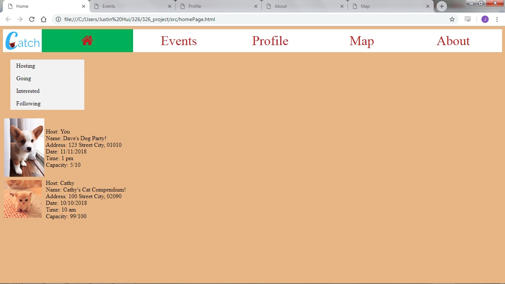
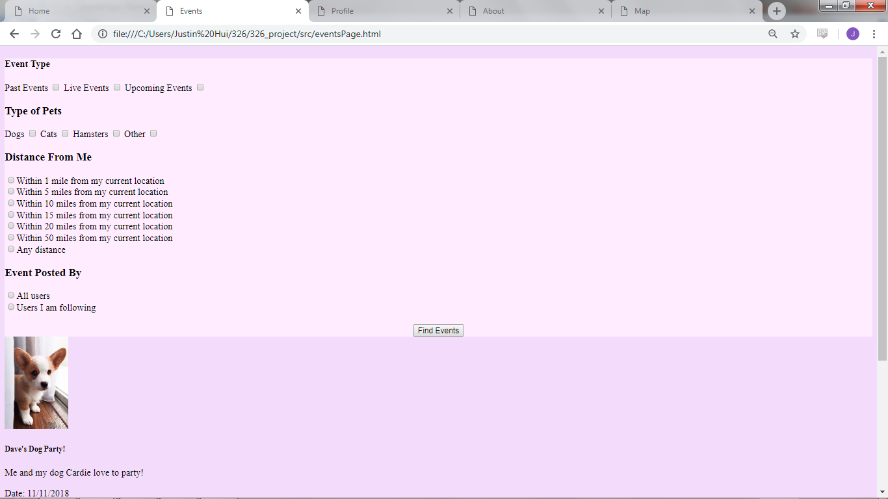
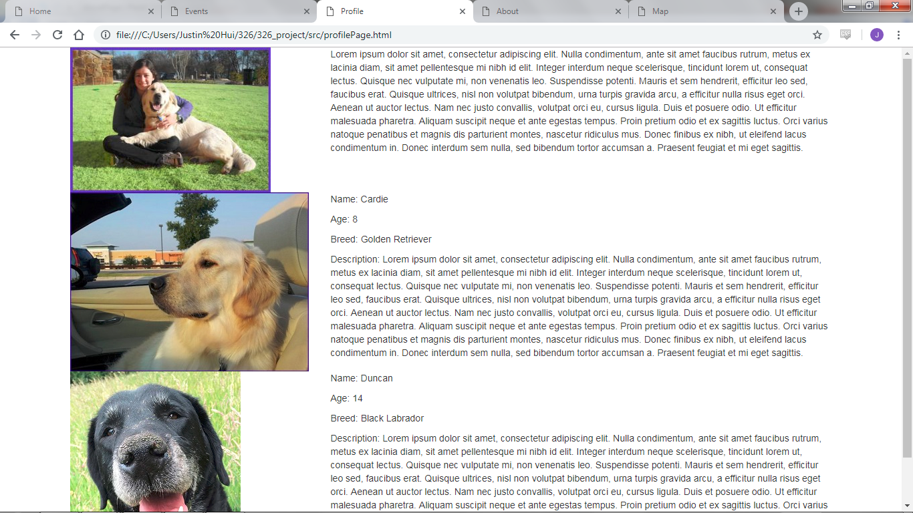
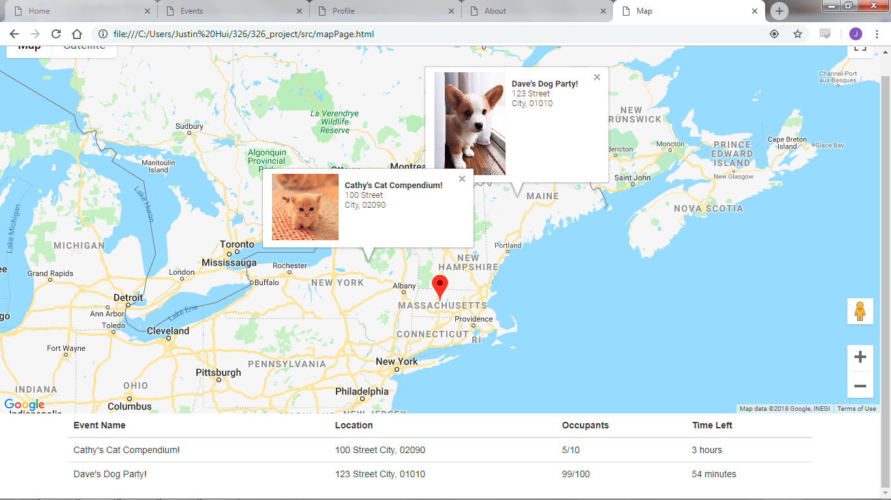
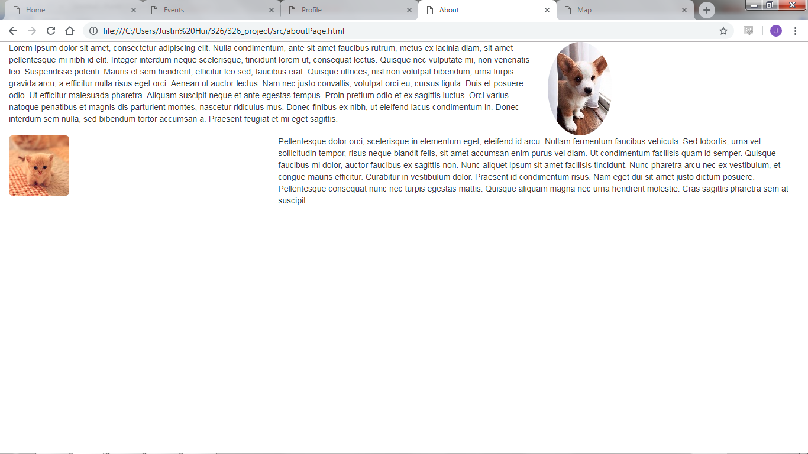

# TEAM NAME: flour

# WEB APPLICATION NAME: Catch

# Team Overview

* Bailey Boone, baileyboone
* Erica Zheng, pinebay
* Justin Hui, jhui04
* Parth Nagraj, pdnagraj

# Innovative Idea

Catch is a pet-based social media platform where people can publically announce a location and a window of time where other users can play with this pet. It's similar to other common social media platforms such as Facebook, Instagram, Snapchat, except that it has a real-time aspect.

On Facebook, content can be viewed at any time, whereas Catch is similar to the Story Feature that Snapchat has implemented. Owner's will create an event with a time and a public place that their pet is available to be played with. Other users can bring their own pet if they wish but registering a pet to the site is not a requirement.

# Important Data

1. Location: One of our major UI components will be a real time map of the user and the events happening around them. This is so that they can conveniently find events. We will have continuously updating data on location of the user and events near them.

2. Events: Pet owners can create events to notify nearby pet lovers. The data involved will be: location, time, date, and description. This data will be viewable and searchable so that users can find nearby events.

3. Pets: Pet owners can create profiles for each of their pets, this data will include images, species, age, and a description of their personality.

4. Activity: Users will generate data based on the events they attended. This will appear on their profile for other users to view. This data will include but is not limited to: how long they spent at each event, comments they had for the event, the pets they brought to the event. 

5. Profile: Users will have profiles that other users can use to view the past events they have hosted, attended, or to view pets they have interacted with previously.

# User Interface

Provide a description and images of the user interface your
application will intend on supporting.

1. Home - homePage.html
This page will be where the information on events most relevant to the user is aggregated. The user can sort events by the ones they are hosting, going to, interested in, or following. Events will be displayed in a list, with an image and important details such as the host, address, date, time, and capacity. 

2. Events - eventPage.html
This page will be where the user can search for events by a number of parameters: distance, species of pet, time, date, and events being hosted by users they are currently following. 

3. Profile - profilePage.html
This page will be where the user can write a short description about themselves and include details that they feel like sharing. Additionally, they will also have profiles for each of their pets that they wish to bring to events. These pet profiles will include name, age, breed, a picture, and a description of their personality.

4. Map - mapPage.html
This page will be where the user can view a real-time map of the events happening around them. If the user is taking their dog out for a walk, they could choose to stop by any of these events, assuming sufficient vacancy at the event. Below the map is an aggregated table of the events for a different view. 

5. About - aboutPage.html
This page will be about the project itself but also rules and guidelines for both pet owners and pet lovers. The inherent nature of meeting with strangers means that respect and caution are necessary. All event locations will be public and pet lovers should respect the wishes of the pet owners. If a pet owner wants to end an event early because their pet is tired, that is completely up to them.

