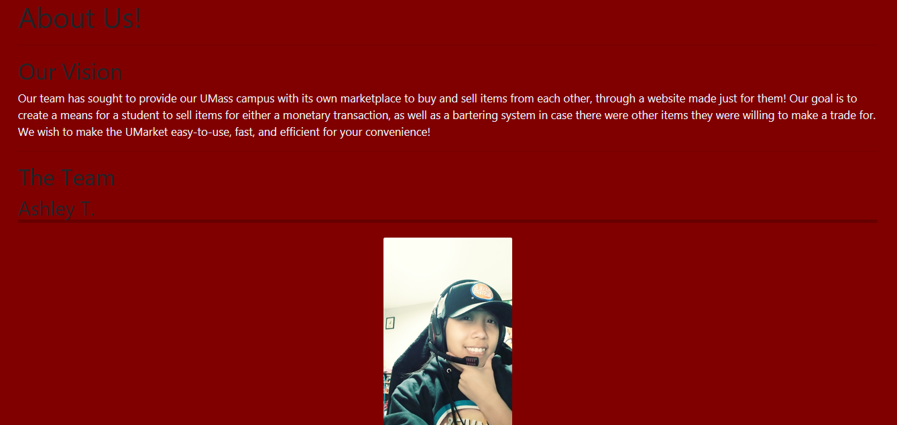
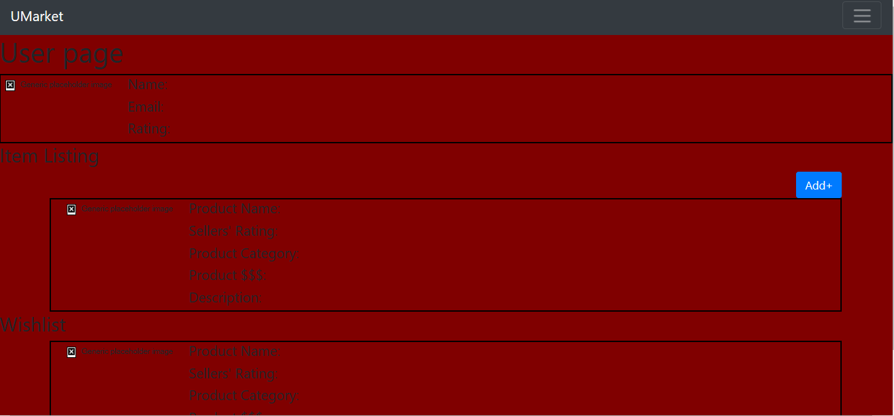
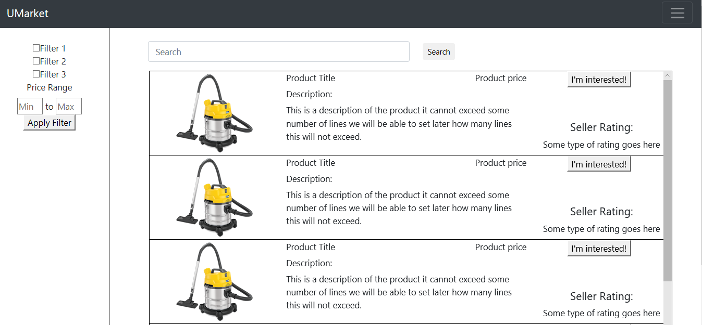
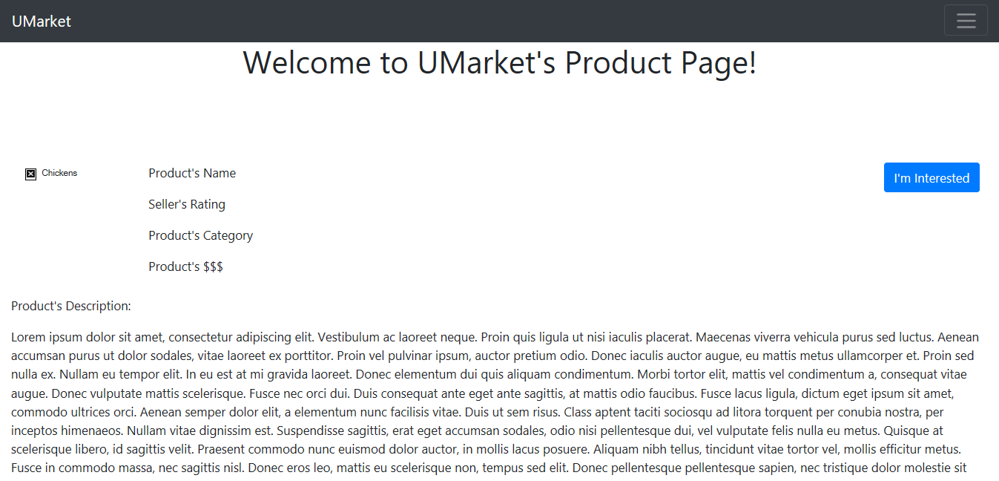

# aTlas

# UMarket

# Team Overview

* Tajour Cohen-Henry, Tajman
* Quyen Tran, qtran09
* Aristotel Fani, afani97
* John Domenichelli, Scorch219
* Ashley Tapulado, iFractalus
* Brandon Curran, brandoncurran326

# Innovative Idea

UMass Amhest students often struggle to find certain products they need or sell them near or throughout the semester. To remedy this, our project, UMarket, aims to provide a platform for students to buy, sell, or exchange products with each other, without needing to travel far distances to any sketchy locations that websites like Craigslist may demand. Listings will be cleaner and more organized, and users will find it easier to navigate for specific items.

# Important Data

* User data
* Item info
* Safe meetup spots/common areas
* Item categories
* Seller ratings/comments

# User Interface

The home page is the landing page that users not logged in will be redirected towards. Users will need to log in with a valid umass email to make it past this page.

The about page is a page with the group member bios and information about the website, including purpose, inspiration, and validity for its usage.

The user page is a user profile page that will display information about a given user. Information displayed will be basic profile information, items they are selling, and items they would like to purchase.

The browsing page is the main page where users are able to search for products listed by other users. Users may filter products based on their needs and view name, short descriptions, and price of the product. Additional information is provided such as user rating.

The product page is the individual page of a single item listing. Here, users are able to view a full description of an item as well as all information displayed on the browsing page. In addition, a button is listed that will help users express their interest in the product and will provide communication between the buyer and seller.

