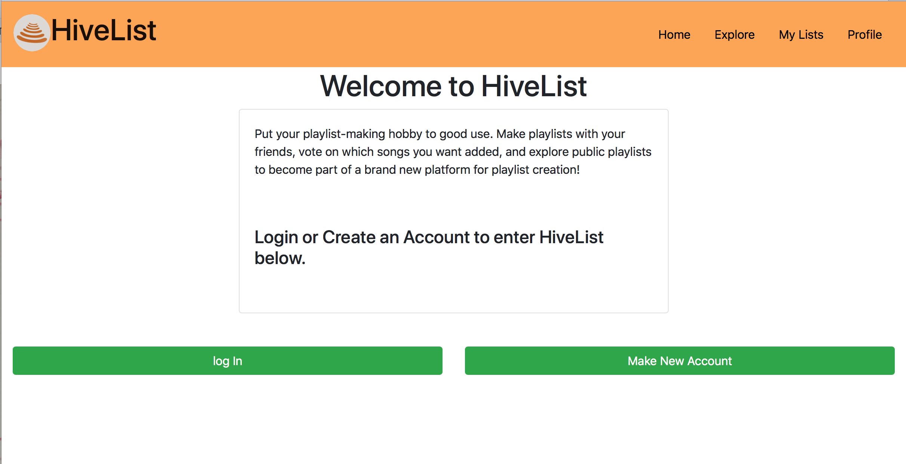
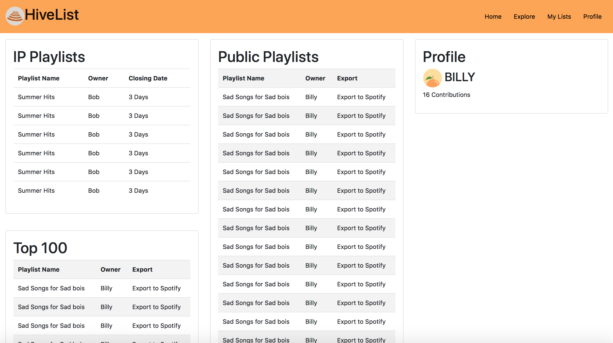

# Big-O

# HiveList

# Team Overview

* Jay Trask, JayTrask
* Emily Earl, eearl
* Collin Giguere, cdgiguere
* Olivia Higgins, omhiggins
* Caleb Carr, Caleb-Carr
* Omar Sanchez, Osanchez

# Innovative Idea

HiveList is a collaborative playlist builder. The application will be built on top of the spotify API. The objective of the application is to allow several people to build a playlist together, vote on which songs should be added to the playlist, and eventually export the playlist to spotify.

# Important Data

HiveList will implement the following datasets:
* Spotify Data: 
    Using simple REST principles we will use data in the Spotify API to get songs/song demos, searching features.
* User Data: 
    Users will need to log into our system, so we will have their email addresses that they want linked to their account and also their password.
* Playlist Data: 
    Each playlist will be made of a list of songs, which includes artist, who contributed it to the playlist, the date added, length of song, and popularity.
    * Voting Data:
    Each song added to a playlist will be voted on by the users, so we'll have to keep a tally of that, in both percentage and raw form.
    * Statistical Data (Top songs, Playlists, etc.):
    This is based off the user's activity on the website. It will contain their preferences for music, the amount of time they've listed to the playlist, and the songs they add to playlists most.

# User Interface

The Following pages will be created for the application:
* Login/Create Account
	* A Simple login page that allows users to login to an existing account or create a new one. The Login page has a very simplified description of the website as well as will implement a full logo once designed.
    
* Home Screen
	* The Home screen is the page the user will be brought to once logging in. The Home is broken up into four major data deposits. The first is a list of in-progress playlists that the user is a contributor or owner of; this provides a quick overview of said playlists.
	Underneath the IP playlists are the the beginning few playlists of the 'Top 100' playlists on the site; these will be playlists created within the app that receive the best feedback from a public voting system. The middle column of the page, which
	makes up the bulk of the page, is a list of public In-Progress playlists that the user can join. Unlike the top 100 playlists, these are unfinished, giving the user an easy-access list of interesting playlists they can help construct. Finally, the right side of
	this page is a quick bare-bones overview of the current users profile. Currently it displays their profile picture, name, and number of contributions; this will be flushed out as we obtain more user data.
    
* Explore 
	* The Explore page is a more in-depth look at the middle column of the home page. This page consists of a much larger list of public in-progress playlists that users can join in on contributions. Additions to this page that differ from the
	home page include a filtering system that allows users to search for playlists based on keywords and descriptions. This page also includes a list of trending popular songs.
* My Lists
	* The My Lists page is a simple overview of the current lists that the user is added as a contributor on. The left half of the page is committed to In-Progress Playlists, while the right half of the page contains a list of playlists that
	are complete and the user has contributed on. This page also contains links to all of the playlists, which bring up the current-playlist page.
* Current Playlist
	* The Current Playlist page is a page to view individual playlists, both in-progress and finished playlists. The Left half of this page is a list of all songs on the page, as well as an option to vote on whether the songs should be added to the playlist or not.
	Inside of this column is an option to get to the Playlist Settings page. The right half of this page contains two important features. The first is the add songs feature, which allows you to search through spotify's database in search for
	songs, and add them to the playlist. This also includes some suggestions based on the songs already added to the playlist. Underneath this is a list of the contributors for a playlist, and provides links to view contributors profiles.
* Playlist Settings
	* The playlist settings page allows you to edit several main components of playlists, including the name of the playlist, a description for the playlist, whether the playlist is private or public access, voting settings that includes how long the voting period
	will last as well as what percent of positive votes a song needs to be added at the conclusion of the period, and finally the options to edit the contributors of a playlist.
* User Profile
	* The User Profile page is an overview of a users account. The central section of this page is the profile overview from the home page, which for now includes their name, picture, when they joined, how many contributions, as well as some playlist data including
	how many the user is involved with and how many the user has created. Underneath this section is general user settings, such as email, password, and privacy settings. The left half of this page includes an overview of recent contributions. The right half of this
	page is reserved for suggestions and statistics based on contributions and other criteria.

