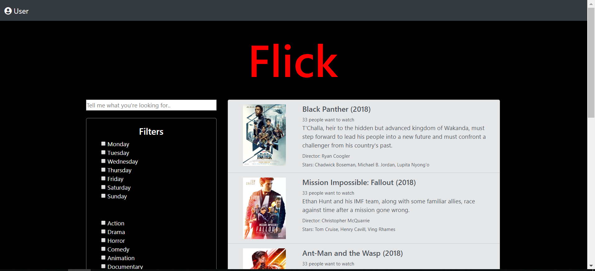
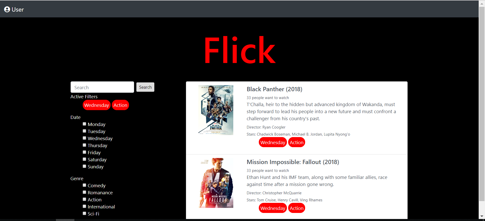
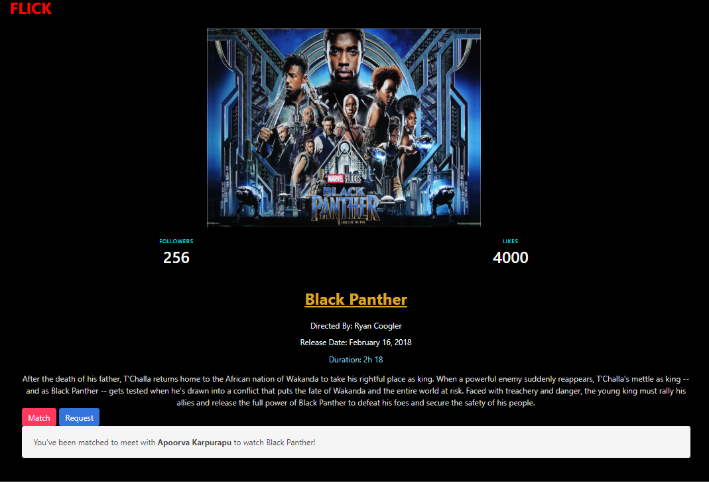
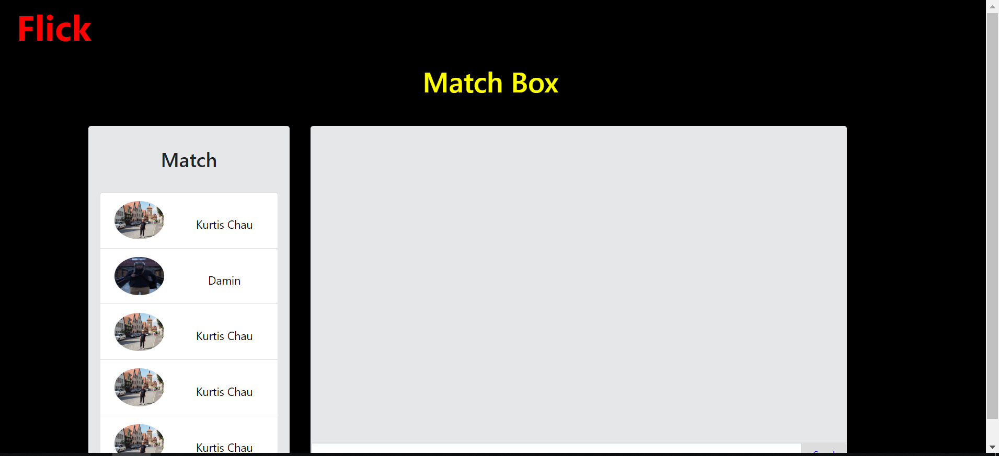
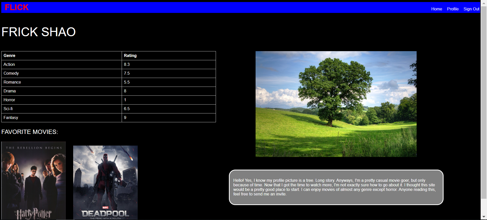

# TEAM NAME

Knock OUt

# WEB APPLICATION NAME

Flick

# Team Overview

Kuhu Wadhwa github: KuhuWadhwa
Apoorva Karpurapu github: akarpurapu
Kurtis Chau: kurtiswchau
Damin Zhang github: daminz97
Frick Shao - github: frickshao
Long To - github: tnlong1997

# Innovative Idea

Flick is an online movie matching website for Five College students. Currently there is an iOS application CINEMEET provides similar service as Flick does, but only limited to Apple users. With Flick, users can start a request or find a match anytime anywhere. All users will be verified by email ends by “.edu” for security. Flick also provides a useful tool for movie fans, a movie list where users can look up for casts or director information.  

# Important Data

User’s first name, last name, gender, bio and student ID card picture. We use user’s first, last name and student ID card to cross check the user does exist and uses real name to avoid fraud. By asking gender information, users can either choose from Male, Female or Don’t want to specify, but the purpose is collecting basic information for future analysis to improve user satisfaction. We also ask users to create their own public bio, which can show their favorite movie genre or actors, and we will implement smarter matching algorithm base on grabbing key words from the bio.

# User Interface

1. The first one is a list of movie includes movie title, cast, director and poster. The list is sorted in most popular order base on IMDB information.
2. The second one is filter box, which contains different filters user can apply onto the list. For example, release time, genre.
3. The third one is search bar for user directly look for a certain movie, or movie’s cast includes certain actor/actress.
4. The fourth one is a two-tab block: match and request. Inside “match” tab, user can view all available requests of certain movie with user basic information, location and time. In “ request” tab, user can start a request of certain movie.
5. The fifth one is an instant message box for users to communicate once they matched with each other.
6. The sixth one is a user profile page where user can upload a profile picture, a bio, their movie ratings, and favortie movies.

